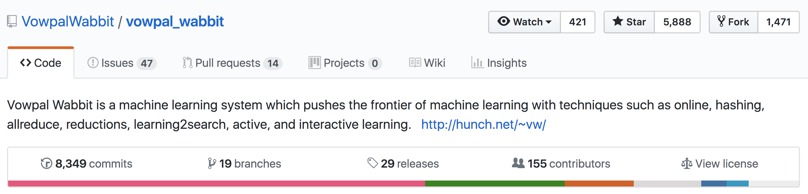

# Down the Wabbit Hole

### Some FP Design Patterns in ML engineering

Chris McKinlay

Note:

Hi! Hi Im Chris and I work at Formation, mostly on on ML stuff. 

We're using reinforcement learning to reinvent loyalty programs.

I'm going to share some techniques we've been using in our Haskell codebase to help us write better code.

# Better code?

* Correctness?
<!-- .element: class="fragment" -->
* Maintainability?
<!-- .element: class="fragment" -->
* Testability?
<!-- .element: class="fragment" -->
* Performance?
<!-- .element: class="fragment" -->

Note:

Of course, better is subjective. Faster code is better, but performance isn't
free -- you have to spend time implementing it.  Code that gives the right
answer is important, but sometimes "close enough" is good enough.

Maintainability is another good point. How easy is the software to maintain,
refactor, and modify? If busienss rules need to change, then how difficult will
it be to make these logical changes? Unfortunately, this is difficult to
understand without actually attempting to do the change, so it's often too
late.

Testability -- this is a really good metric for good code!
Testing code is often the first time that you go to actually use the code you wrote.
It's the first time you have to setup the surrounding code and infrastructure, and you get immediate feedback on how good your code is to reuse.

# Reproducibility
 
<!-- .element: class="fragment" -->

Note:

This is one most people are aware of. ML code often contains hidden configuration dependencies (e.g. hyperparameters, seeds for random number generators, upstream feature engineering, etc).

# Glue code
 
<!-- .element: class="fragment" -->

## Fear not though...

"Glue code can be reduced by choosing to re-implement specific algorithms within the broader system architecture." -Sculley et. al.

<aside class="notes">

</aside>

### ... unless you're not Google

 
<!-- .element: class="fragment" -->

