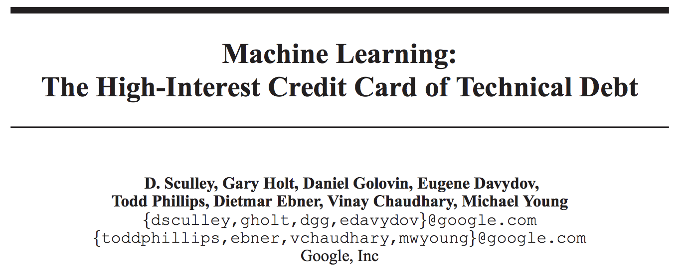

## Down the Wabbit Hole

Some Haskell Design Patterns in ML engineering
<!-- .element: class="fragment" -->

Chris McKinlay
<!-- .element: class="fragment" -->

Note:

Hi! Hi Im Chris and I work at Formation, mostly on on ML stuff. 
We're using reinforcement learning to reinvent loyalty programs.

# 
 

Note:
productionizing ML use cases can be challenging
I'm going to share some best practices we've been using in our Haskell codebase to help us write better ML code.

# ML Best Practices?
## AKA
<!-- .element: class="fragment" -->
## Some person's opinion
<!-- .element: class="fragment" -->
Note: Best pracitices in ML haven't really been established.

# This is subjective

* Correctness?
<!-- .element: class="fragment" -->
* Performance?
<!-- .element: class="fragment" -->
* Testability?
<!-- .element: class="fragment" -->
* Maintainability
<!-- .element: class="fragment" -->

Note:

Correctness can be hard to even define for ML systems, and oftentimes "close enough" is good enough.

Faster code is better, but performance isn't free -- you have to spend time implementing it. 

Testability is a really good metric for good code! 

In the end, maintainability is what was most important to us. We need software we can maintain, refactor, and modify easily.

We're a small startup trying to apply reinforcement learning to customer relationships. Assumptions are bound to change. How difficult will it be to adapt to these changes? 

# 
 
Note:
a lot of people cite the google tech debt paper. 
this is a really great paper, but there are some things in it 

# Glue Code

> "Glue code is costly in the long term because it tends to freeze a system to the peculiarities of a specific package."

Note:
Using generic packages for machine learning often results in a glue code system design pattern, in which a massive amount of supporting code is written to get data into and out of general-purpose packages.

# 
> "Glue code can be reduced by choosing to re-implement specific algorithms within the broader system architecture."
Note:

#  

Note:
i dont think this advice is very practical. 
i mean maybe it is if you're Google and have thousands of people to throw at a problem.
but for anything moderately complex this is a terrible idea for a startup.
we were in this situation last year.

# 
 
Note:
vw was an out-of-box solution that solved a simple version of our RL problem 
our data scientists understood how to use it
it is far too complex to reimplement quickly, and even if we did we had very little assurance that our use case would be the same when we finished
our engineering solution was to establish common APIs to wrap it
allows supporting code to be more reusable and reduces the cost of changing packages.
in this talk i'll explain how we use haskell's type system and some design patterns to accomplish this
show how it works w/ tensorflow and vw
finally go through a use case with some supporting library code

