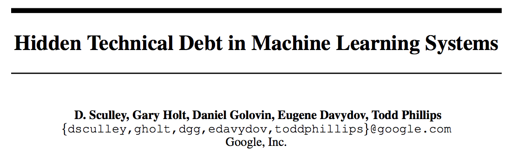

# Down the Wabbit Hole

## Some FP Design Patterns in ML engineering

Chris McKinlay

Note:

Hi! Hi Im Chris and I work at Formation, mostly on on ML stuff. 

We're using reinforcement learning to reinvent loyalty programs.

I'm going to share some techniques we've been using in our Haskell codebase to help us write better code.

# Better code?

* Correctness?
<!-- .element: class="fragment" -->
* Maintainability?
<!-- .element: class="fragment" -->
* Testability?
<!-- .element: class="fragment" -->
* Performance?
<!-- .element: class="fragment" -->

Note:

Of course, better is subjective. Faster code is better, but performance isn't
free -- you have to spend time implementing it.  Code that gives the right
answer is important, but sometimes "close enough" is good enough.

Maintainability is another good point. How easy is the software to maintain,
refactor, and modify? If busienss rules need to change, then how difficult will
it be to make these logical changes? Unfortunately, this is difficult to
understand without actually attempting to do the change, so it's often too
late.

Testability -- this is a really good metric for good code!
Testing code is often the first time that you go to actually use the code you wrote.
It's the first time you have to setup the surrounding code and infrastructure, and you get immediate feedback on how good your code is to reuse.

# Common issues in ML
## Reproducibility
 <!-- .element: id="plain" -->

Note:

This is one most people are aware of. ML code often contains hidden configuration dependencies (e.g. hyperparameters, seeds for random number generators, upstream feature engineering, etc).

# Common issues in ML
## Glue code
 
<!-- .element: class="fragment" -->

### "Glue code can be reduced by choosing to re-implement specific algorithms within the broader system architecture." -Google

Note:

This one is less well-known. Machine learning packages may often be treated as black boxes, resulting in large masses of “glue code” or calibration layers that can lock in assumptions.

This is certainly true of vowpal wabbit, a contextual bandits library we bootstrapped with. Even with frameworks like tensorflow ...

Machine learning researchers tend to develop general purpose solutions as self-contained packages.

Using self-contained solutions often results in a glue code system design pattern, in which a massive amount of supporting code is written to get data into and out of general-purpose packages.

This glue code design pattern can be costly in the long term, as it tends to freeze a system to the peculiarities of a specific package. 

General purpose solutions often have different design goals: they seek to provide one learning system to solve many problems, but many practical software systems are highly engineered to apply to one large-scale problem, for which many experimental solutions
are sought. While generic systems might make it possible to interchange optimization algorithms,
it is quite often refactoring of the construction of the problem space which yields the most benefit
to mature systems. The glue code pattern implicitly embeds this construction in supporting code
instead of in principally designed components. As a result, the glue code pattern often makes exper5
imentation with other machine learning approaches prohibitively expensive, resulting in an ongoing
tax on innovation.

At first, this may seem like a high cost to pay—re-implementing a machine learning
package in C++ or Java that is already available in R or matlab, for example, may appear to be
a waste of effort. But the resulting system may require dramatically less glue code to integrate in
the overall system, be easier to test, be easier to maintain, and be better designed to allow alternate
approaches to be plugged in and empirically tested. Problem-specific machine learning code can
also be tweaked with problem-specific knowledge that is hard to support in general packages.
It may be surprising to the academic community to know that only a tiny fraction of the code in
many machine learning systems is actually doing “machine learning”. When we recognize that a
mature system might end up being (at most) 5% machine learning code and (at least) 95% glue code,
reimplementation rather than reuse of a clumsy API looks like a much better strategy

